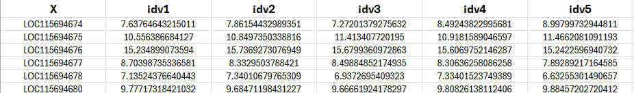
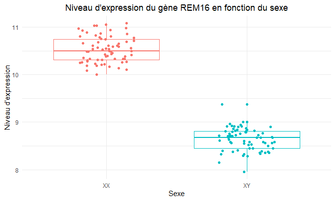
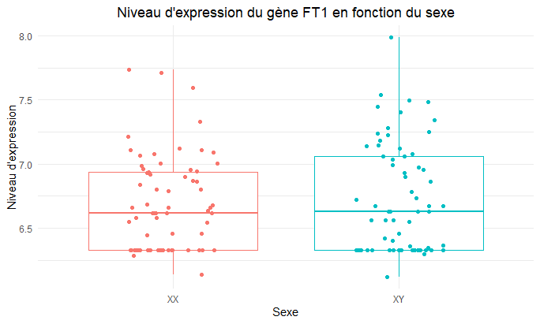
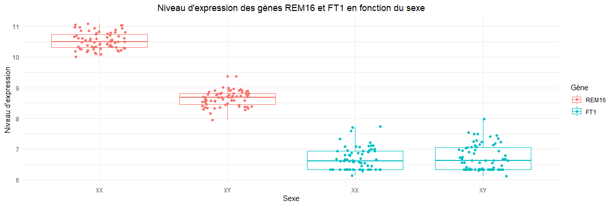

# SexCannalyzer

### Auteur : Marc-Antoine Chiasson  
### Date : 2024-10-30

## Description
**SexCannalyzer** est un script R permettant de déterminer le sexe des plants de cannabis en fonction de l'expression différentielle de deux gènes spécifiques : **REM16** et **FT1**. En analysant les niveaux d'expression de ces gènes, le script permet de classifier les plants de cannabis comme mâle ou femelle et d'identifier les cas potentiellement problématiques. Cette approche est utile pour les chercheurs en biologie végétale et les producteurs de cannabis qui souhaitent détecter le sexe des plants de manière précoce.

## Cas d'utilisation
Le but de **SexCannalyzer** est de :
- Identifier les différences d'expression entre deux gènes clés pour la détermination du sexe du cannabis.
- Filtrer les données transcriptomiques et visualiser les niveaux d'expression de **REM16** et **FT1**.
- Classifier les plants en tant que mâles ou femelles selon les critères d'expression génétique établis.

## Données d'entrée
- **Fichier de données transcriptomiques** : Un fichier CSV contenant les données d'expression des gènes pour différents échantillons. Le fichier doit inclure une colonne nommée `X` avec les identifiants de gènes, tels que `LOC115699937` et `LOC115696989`, qui seront automatiquement renommés en **REM16** et **FT1**. Chaque colonne représente l'identifiant du génotype.


## Résultats
Le script produit plusieurs types de sorties :
1. Un graphique de l'expression du gène REM16 en fonction du sexe.


2. Un graphique de l'expression du gène FT1 en fonction du sexe.



3. Un graphique combiné de l'expression des gènes REM16 et FT1 colorié selon le sexe.


1. **Tableaux transformés** pour les gènes **REM16** et **FT1** avec leurs niveaux d'expression pour chaque échantillon et sexe.
2. **Graphiques** montrant les niveaux d'expression de **REM16** et **FT1** en fonction du sexe des échantillons. Ces graphiques permettent de visualiser la classification des plants en mâle ou femelle.
3. **Critères d'interprétation** :
   - **Femelle** : Si REM16 est exprimé autour de 10,5 et FT1 est peu exprimé (~6,5).
   - **Mâle** : Si REM16 est exprimé autour de 8,75 et FT1 est exprimé.
   - **Problème** : Si REM16 est exprimé sans que FT1 soit exprimé.

## Instructions

### Pré-requis
- **R** version 4.0 ou supérieure.
- Packages **dplyr**, **ggplot2**, et **ggpubr** (pour les visualisations).
  
### Étapes pour exécuter le script
1. **Configuration du répertoire de travail** : Placez le fichier `2_Data_RNASeq_Cannabis_Sex.csv` dans le dossier `data` du répertoire de travail.
  
2. **Charger et exécuter le script** : Lancez le script `SexCannalyzer.Rmd` dans RStudio ou via une ligne de commande R.

3. **Interpréter les graphiques et résultats** :
   - Ouvrez les graphiques générés pour observer les niveaux d'expression de **REM16** et **FT1**. 
   - Suivez les critères d'interprétation pour déterminer le sexe de chaque échantillon :
     - **REM16 ~ 10,5 et FT1 ~ 6,5** : Femelle
     - **REM16 ~ 8,75 et FT1 exprimé** : Mâle
     - **REM16 exprimé sans FT1** : Cas problématique à vérifier

### Exemple d'exécution
Pour exécuter le script directement dans RStudio :
   ```r
   # Chargez le fichier RMarkdown dans RStudio, puis cliquez sur "Knit" pour générer les rapports HTML et PDF.
